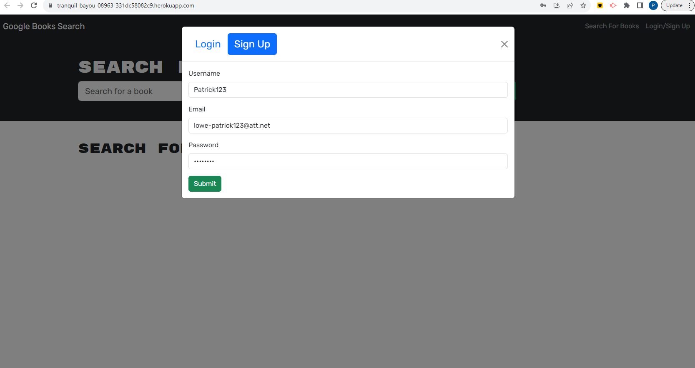
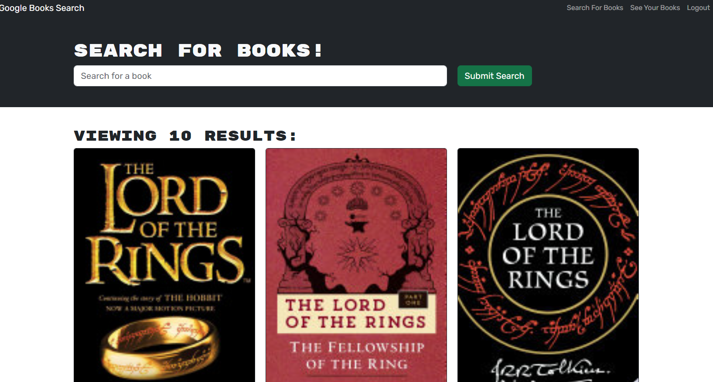
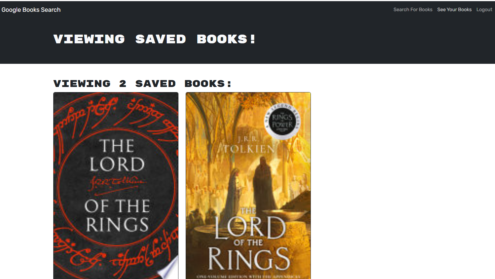

# 

# Book Search Engine

## [Patrick Lowe](https://github.com/PatrickWLowe)

## Description

#### An app that allows users to Login, Logout, Signup, Look for books, and Save books to their profile. This App uses google API to search for books.

## Technologies-Used


### bcrypt

### GitBash

## Installation

#### The websiteis being hosted on [Heroku](https://tranquil-bayou-08963-331dc58082c9.herokuapp.com/). If you want to have it locally. You will need clone the repository and open the folder locally. Then you will need to run "npm install" in the parent folder. Then you will need to run "npm run build" Then "npm run develop" to get the application working.

## User Story

```md
AS AN avid reader
I WANT to search for new books to read
SO THAT I can keep a list of books to purchase
```

## Acceptance Criteria

```md
GIVEN a book search engine
WHEN I load the search engine
THEN I am presented with a menu with the options Search for Books and Login/Signup and an input field to search for books and a submit button
WHEN I click on the Search for Books menu option
THEN I am presented with an input field to search for books and a submit button
WHEN I am not logged in and enter a search term in the input field and click the submit button
THEN I am presented with several search results, each featuring a book’s title, author, description, image, and a link to that book on the Google Books site
WHEN I click on the Login/Signup menu option
THEN a modal appears on the screen with a toggle between the option to log in or sign up
WHEN the toggle is set to Signup
THEN I am presented with three inputs for a username, an email address, and a password, and a signup button
WHEN the toggle is set to Login
THEN I am presented with two inputs for an email address and a password and login button
WHEN I enter a valid email address and create a password and click on the signup button
THEN my user account is created and I am logged in to the site
WHEN I enter my account’s email address and password and click on the login button
THEN I the modal closes and I am logged in to the site
WHEN I am logged in to the site
THEN the menu options change to Search for Books, an option to see my saved books, and Logout
WHEN I am logged in and enter a search term in the input field and click the submit button
THEN I am presented with several search results, each featuring a book’s title, author, description, image, and a link to that book on the Google Books site and a button to save a book to my account
WHEN I click on the Save button on a book
THEN that book’s information is saved to my account
WHEN I click on the option to see my saved books
THEN I am presented with all of the books I have saved to my account, each featuring the book’s title, author, description, image, and a link to that book on the Google Books site and a button to remove a book from my account
WHEN I click on the Remove button on a book
THEN that book is deleted from my saved books list
WHEN I click on the Logout button
THEN I am logged out of the site and presented with a menu with the options Search for Books and Login/Signup and an input field to search for books and a submit button
```

## License

### This project is licensed under the MIT License

[MIT](https://opensource.org/licenses/MIT)

## Screenshots of the APP







## Deployed Website

[Book Search Engine](https://tranquil-bayou-08963-331dc58082c9.herokuapp.com/)

## References

### https://coding-boot-camp.github.io/full-stack/mongodb/deploy-with-heroku-and-mongodb-atlas

### https://coding-boot-camp.github.io/full-stack/mongodb/how-to-set-up-mongodb-atlas

### https://stackoverflow.com/questions/14612695/how-to-restart-a-rails-server-on-heroku
